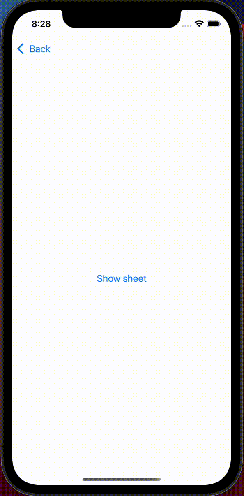
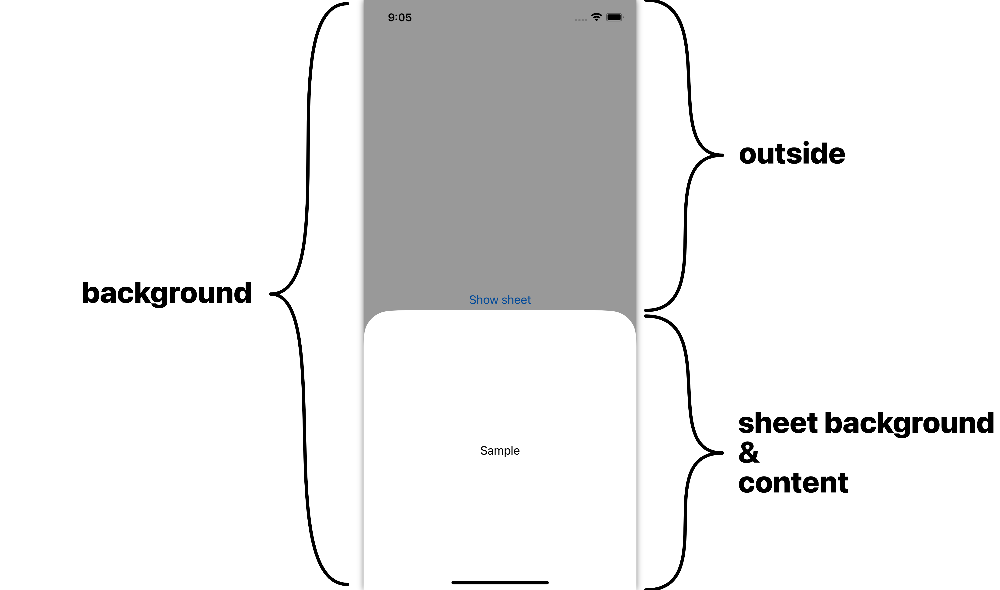
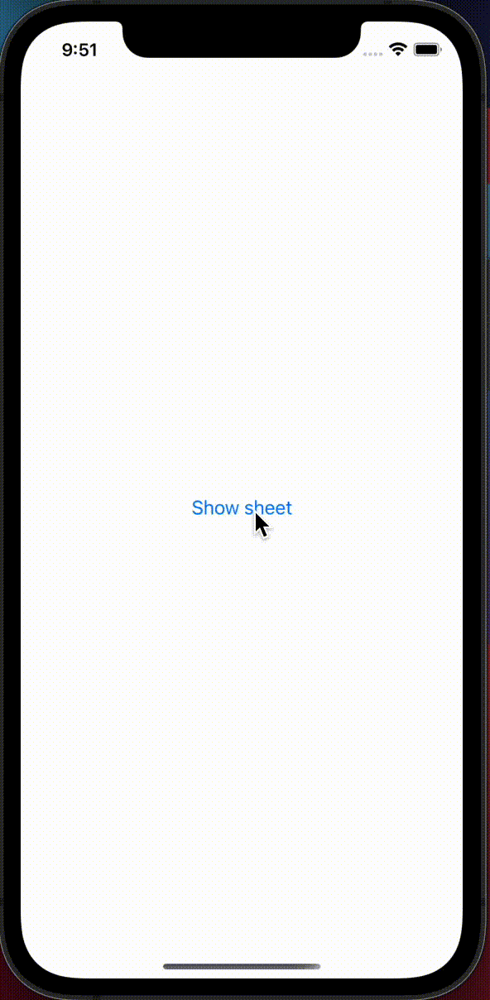
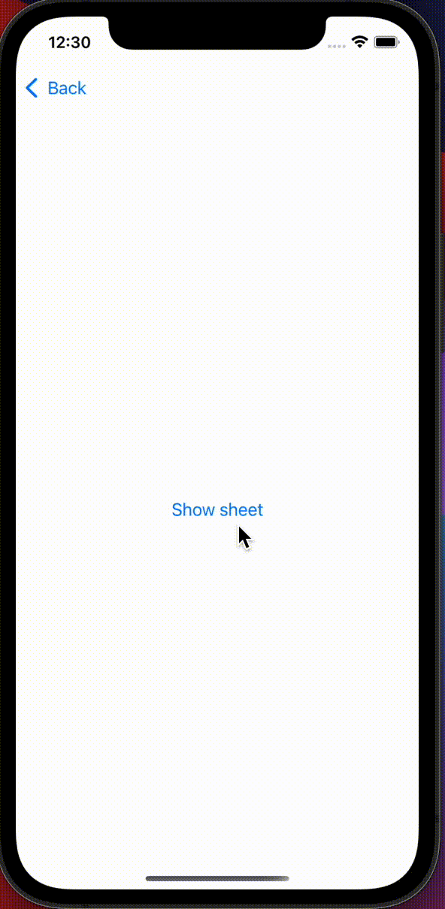
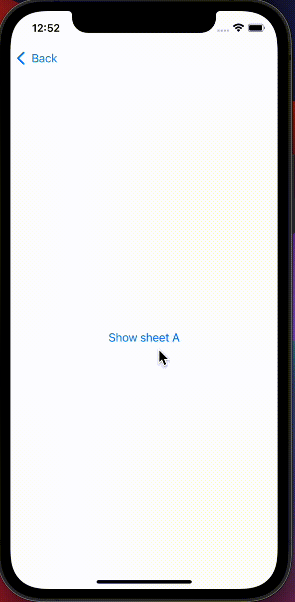
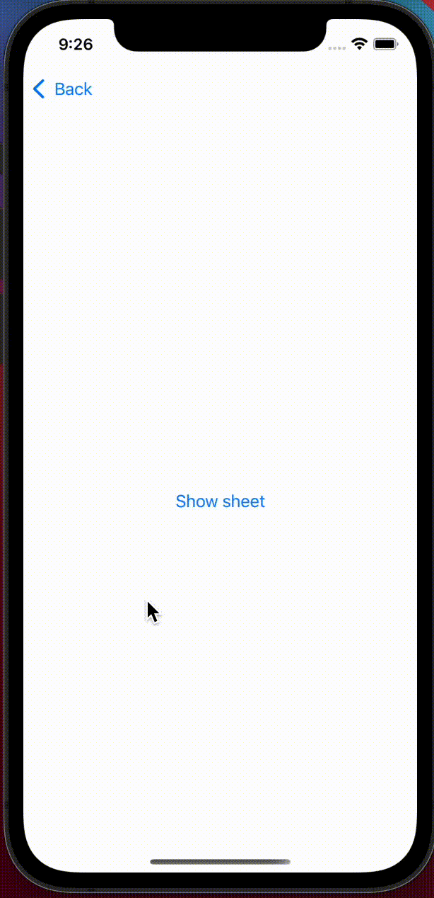
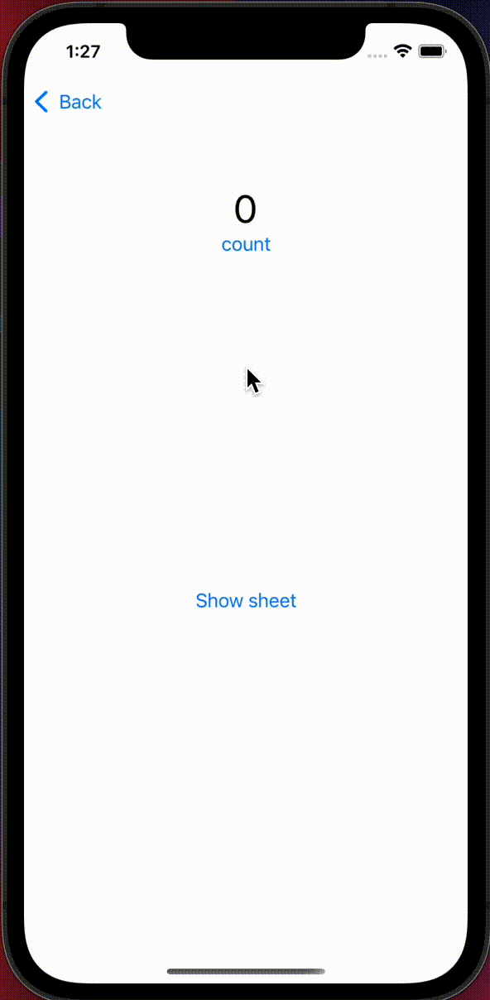

# ResizableSheet

ResizableSheeet is a half modal view library for SwiftUI.
You can easily implement a half modal view.

## Target 
- Swift5.5
- iOS14+

## Installation
Only SwiftPM

## Features

- 3 states are supported.
  - hidden
  - midium
  - large
- The midium size is automatically calculated baesd on the content.
- You can update view for each state.
- ResizableSheet contains `ResizableScrollView` and  `TrackableScrollView`.  
  `TrackableScrollView` is a wrapper view of `UIScrollView` and the offset synchronizes with dragging of sheet.  
  `ResizableScroolView` is a wrapper class of `TrackableScrollView`, and 
- ResizableSheet can be shonw on another ResizableSheet.

## Simple Example 
To use ResizableSheet, follow these steps.

1. Create `ResizableSheetCenter` and embed it to your view in your root view like `RootView`.
```swift
struct RootView: View { 
    let windowScene: UIWindowScene?

    var resizableSheetCenter: ResizableSheetCenter? {
        windowScene.flatMap(ResizableSheetCenter.resolve(for:))
    }
    
    var body: some View { 
        YOUR_VIEW
            .environment(\.resizableSheetCenter, resizableSheetCenter)
    }
}
```

2. Prepare `ResizableSheetState` with `@State`, and call `resizableSheet`. 
   You can customize the resizableSheet by chaining some methods.
```swift
struct SomeView: View {

    @State var state: ResizableSheetState = .hidden

    var body: some View {
        Button("Show sheet") {
            state = .midium
        }
        .resizableSheet($state) { builder in
            builder.content { context in
                Text("text")
                    .padding()
            }
        }
    }
}
```

That's all!  
You can show a half modal view by tapping the button "Show sheet", and you can expand or remove the sheet by dragging it.



## View structure

ResizableSheet has some view components.  
You can control each view components based on current status.

```
ResizableSheet
 └─ background
     ├─ outside
     └─ sheet background
         └─ content
```




## Example

### Complex Layout

You can update the view based on the current status.  
The argument `context` has some informatios about the sheet, like state, view size, progress of dragging and diffY.

Based on the `context`, you can update the content.  
**Tips:** Don't forget to add `.allowsHitTesting(false)` to Color view. If you don't add it, the dragging gesture is not recognized.

```swift
view.resizableSheet($state) { builder in
    builder.content { context in
        VStack {
            Text(context.state == .hidden ? "hidden" :
                    context.state == .midium ? "midium" : "large"
            )
            Color.gray
                .frame(height:
                        context.state == .midium ? max(0, context.diffY) :
                        context.state == .hidden ? 0 : nil
                )
                .opacity(context.state == .midium ? context.percent : 1.0 - abs(context.percent))
                .allowsHitTesting(false)
            Text("Buttom")
        }
        .padding()
    }
}
```



### Supported status

ResizableSheet supports 3 statuses, `.hidden`, `.midium` and `.large`.  
In default setting, the all statuses are supported, but you can stop to support any statuses.

```swift
view.resizableSheet($state) { builder in
    builder.content { context in
        Text("Text").frame(height: 300)
    }
    .supportedState([.midium])
}
```




### Multi Sheets

ResizableSheet supports multiple sheets.  
By adding id, ResizableSheet can show multiple sheets.

```swift

struct SomeSheet: View {

    @State var stateA: ResizableSheetState = .hidden
    @State var stateB: ResizableSheetState = .hidden

    var body: some View {
        Button("Show sheet A") {
            stateA = .midium
        }
        .resizableSheet($stateA, id: "A") { builder in
            builder.content { context in
                Button("Show sheet B") {
                    stateB = .midium
                }.frame(height: 300)
            }
        }
        .resizableSheet($stateB, id: "B") { builder in
            builder.content { context in
                Button("remove all sheet") {
                    stateA = .hidden
                    stateB = .hidden
                }.frame(height: 200)
            }
        }
    }
}

```




### ResizableScroolView (TrackableScrollView)

ResizableSheet includes `ResizableScrollView`.  
The view synchronises the offset with ResizableSheet.  
**Tips:** Using `ResizableScroolView` is recommended because you don't need to calculate the midium size.

```swift
view.resizableSheet($state) { builder in
    builder.content { context in
        ResizableScrollView(context: context) {
            // These views are shown in midium size and large size.
            ForEach(0..<5) { index in
                Text("\(index)")
                    .padding()
            }
        } additional: {
            // These views are shown in only large size.
            ForEach(5..<100) { index in
                Text("\(index)")
                    .padding()
            }
        }
    }
}
```



### EmptyBackground

By passing EmptyView as `background`, user can control both the parent view and the sheet. 

```swift
struct SomeView: View {
    @State var counter = 0
    @State var state: ResizableSheetState = .hidden
    var body: some View {
        VStack {
            Text("\(counter)")
                .font(.largeTitle)
            Button("count") {
                counter += 1
            }
            Spacer()
            Button("Show sheet") {
                state = .midium
            }
            Spacer()
        }
        .resizableSheet($state) { builder in
            builder.content { context in
                Content(counter: $counter).frame(height: 300)
            }
            .background { _ in EmptyView() } // add this line
        }
    }

    struct Content: View {
        @Binding var counter: Int
        var body: some View {
            VStack {
                Spacer()
                Text("\(counter)")
                    .font(.largeTitle)
                Button("reset") {
                    counter = 0
                }
                Spacer()
            }
        }
    }
}
```


